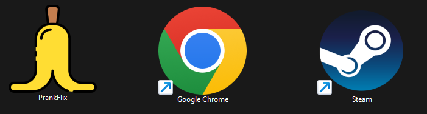

   

PrankFlix is an simple application that opens two new windows when the user attempts to close one. Is just a prank to be funny with your friends. The application does not cause any harm to the system.

## How to close

**To close the application, just click on the in the emoji 10 TIMES and the application will close permanently.**

## How it works

- To prank your friends, just [download](https://github.com/alexandrebeato/prankflix/releases/download/v1.0.0/PrankFlix.exe) the main executable and create a desktop shortcut to it renaming to an common application and changing the shortcut icon.

- To ensure that Windows does not display an alert, open the shortcut at least once.

## Examples

   

## Download

You can download for Windows from the link below:

- [Windows](https://github.com/alexandrebeato/prankflix/releases/download/v1.0.0/PrankFlix.exe)
- Linux (to be tested)
- MacOS (to be tested)

## Getting started

You can run the application using the following commands:

`npm install && npm start`

## Manual build

You can manually build the application using electron-builder. You will need to have Node.js installed.

`electron-builder --win portable`

## Contributing

If you find a bug or have a feature request, please open an issue on GitHub. Pull requests are also welcome!

## License

This project is licensed under the MIT License - see the [LICENSE](LICENSE) file for details
